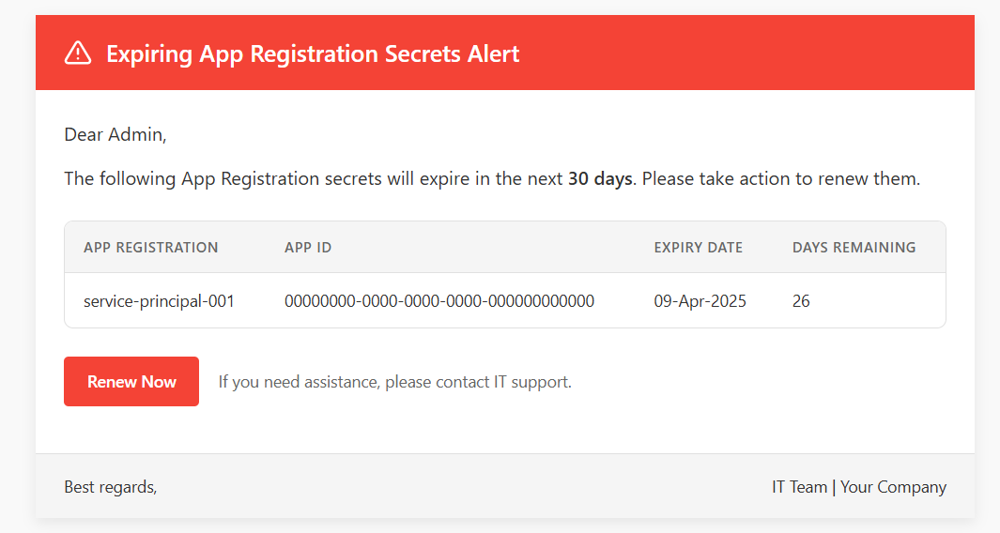

# AzureSecretPulse

This Python script automates the monitoring of Azure AD App Registration secrets and sends email alerts when they are about to expire.

### 📊 Feature Preview:
</img>

---

## Features
- Fetches App Registrations via Microsoft Graph API.
- Checks for expiring secrets within a specified threshold.
- Sends email notifications using SMTP.

---

## 📂 Project Structure
```
azuresecretpulse/
│── src/
│   ├── main.py                        # Main script
│   ├── config.py                      # Configurations
│   ├── email_service.py               # Sends email notification
│   ├── html_renderer.py               # Render HTML reports
│   ├── monitor.py                     # Fetch App Registrations and checks for Expiry Secrets
│── templates/
│   ├── alert.html                     # Email template
│── static/
│   ├── images/
│   │   ├── report_screenshot.png      # HTML alert preview
│── .env                               # Environment variables
│── README.md                          # Project documentation
│── requirements.txt                   # Dependencies
```

---
## 🔧 Setup Instructions

### 1️⃣ Clone the Repository
```bash
git clone https://github.com/Interittus13/azuresecretpulse
cd azuresecretpulse
```

### 2️⃣ Install Dependencies
```bash
pip install -r requirements.txt
```

### 3️⃣ Configure `.env` File
Create a `.env` file with your settings:
```
TENANT_ID=your-azure-tenant-id
CLIENT_ID=your-azure-client-id
CLIENT_SECRET=your-azure-client-secret

EMAIL_FROM=your-email@example.com
EMAIL_TO=test@example.com,test2@yopmail.com
SMTP_SERVER=smtp.office365.com
SMTP_PORT=587
SMTP_PASS=your-password
```
---

## 📊 Running the Script
```bash
python -m src.main
```


---

## 📜 License
This project is **open-source** under the **MIT License**.